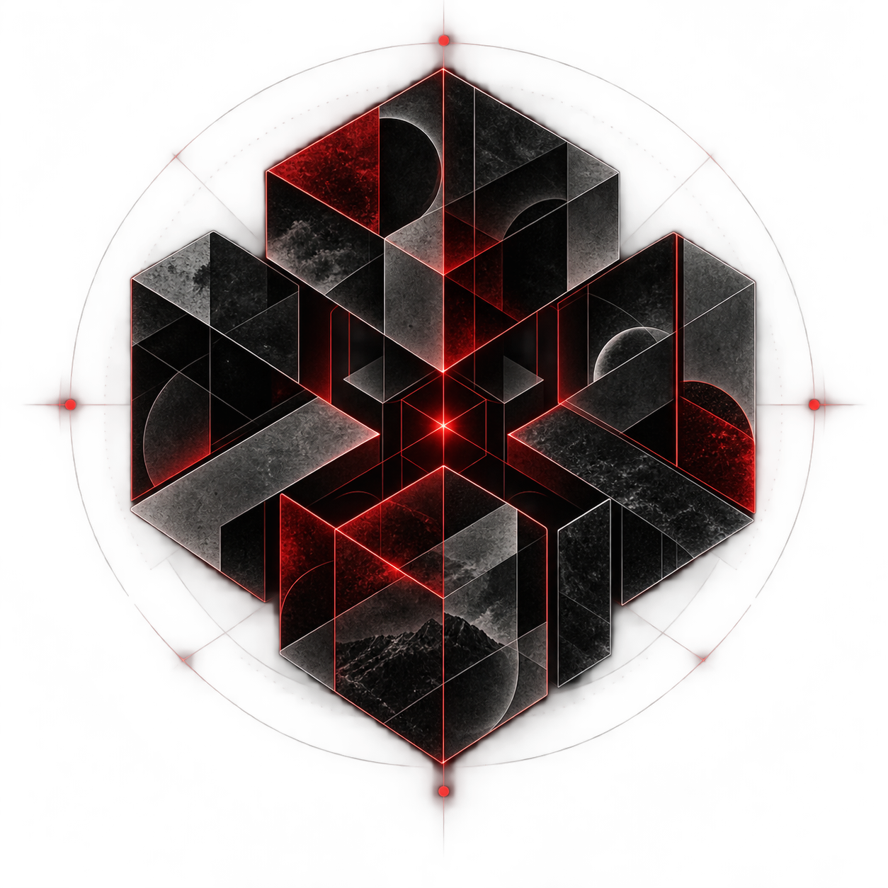
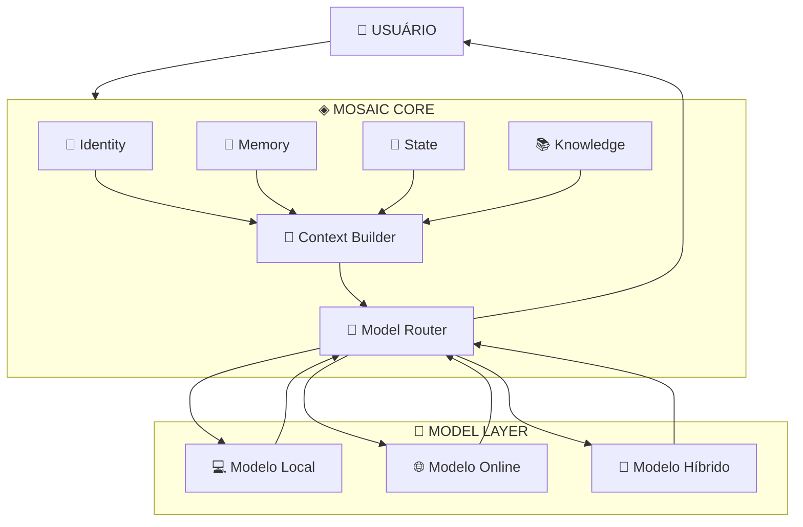
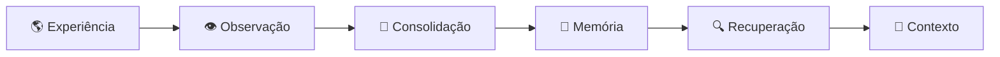
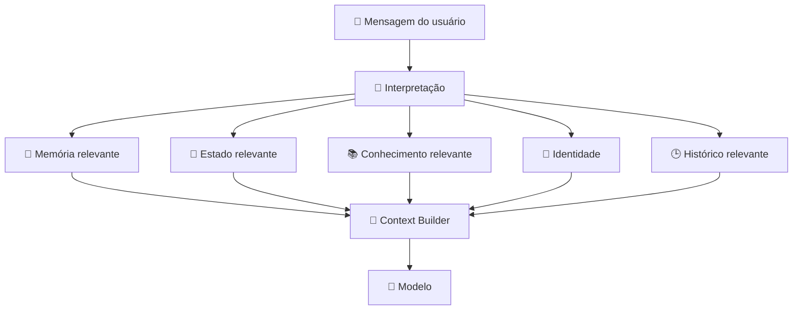

<div align="center">

<br>

# ◈ MOSAIC

### Core de inteligência pessoal · Memória · Contexto · Estado · Continuidade

<br>



<br>

### 🧩 Uma inteligência que não depende de um modelo

<br>

**Mosaic é um núcleo de inteligência pessoal projetado para preservar identidade, memória, contexto, projetos e continuidade independentemente do modelo de IA utilizado.**

<br>


<br>

**🧠 Core** · **🧬 Identity** · **💾 Memory** · **📍 State** · **📚 Knowledge** · **🧭 Context** · **🔌 Models** · **♾️ Continuity**

<br>

[Visão](#-visão) ·
[Princípios](#-princípios) ·
[Arquitetura](#️-arquitetura) ·
[Core](#-mosaic-core) ·
[Memória](#-memória) ·
[Estado](#-estado) ·
[Contexto](#-contexto) ·
[Modelos](#-modelos) ·
[Continuidade](#-continuidade) ·
[MVP](#-mvp) ·
[Estrutura](#-estrutura-do-projeto) ·
[Status](#-status) ·
[Roadmap](#️-roadmap)

<br>

</div>

---

# 🌌 Visão

**Mosaic** nasce de uma ideia simples:

> **A inteligência não deve estar presa ao modelo que a executa.**

Um modelo de linguagem é apenas uma parte do sistema.

O Mosaic foi concebido para manter fora do modelo aquilo que realmente precisa sobreviver:

- identidade;
- memória;
- histórico;
- conhecimento;
- projetos;
- estado atual;
- decisões;
- contexto;
- princípios;
- continuidade.

O modelo pode mudar.

O computador pode mudar.

A infraestrutura pode mudar.

O modelo pode até deixar de existir.

**O Mosaic deve continuar sendo o Mosaic.**

---

# 🧩 O problema

Os assistentes atuais normalmente tratam a conversa como o centro do sistema.

```text
USUÁRIO
   │
   ▼
MODELO
   │
   ▼
RESPOSTA
```

Isso funciona muito bem para perguntas isoladas.

Mas projetos reais possuem continuidade.

Uma pessoa pode dizer:

```text
"Mosaic, onde paramos naquele projeto?"
```

E a resposta não deveria depender de encontrar manualmente uma conversa antiga.

O sistema precisa compreender:

```text
PROJETO
├── objetivo
├── estado atual
├── decisões
├── tarefas concluídas
├── tarefas pendentes
├── bloqueios
├── arquivos
├── histórico
└── última atividade
```

O objetivo do Mosaic é transformar a IA de uma simples interface de conversa em uma **camada persistente de continuidade**.

---

# 🎯 Princípios

| Princípio | Objetivo |
|---|---|
| 🧠 **Core First** | A lógica principal pertence ao Mosaic, não ao modelo |
| 🧬 **Identidade** | Preservar uma identidade estável entre modelos e sessões |
| 💾 **Memória externa** | Memória persistente fora dos pesos neurais |
| 📍 **Estado explícito** | Saber o que está acontecendo agora, não apenas o que aconteceu |
| 🧭 **Contexto** | Entregar ao modelo somente o contexto relevante |
| 🔌 **Model Independence** | Permitir trocar o modelo sem reconstruir o Mosaic |
| 🔐 **Controle** | Dados e memória pertencem ao usuário |
| 📴 **Offline First** | O núcleo não deve depender de internet para existir |
| 🧩 **Simplicidade** | Não adicionar complexidade sem necessidade |
| ♾️ **Continuidade** | Projetos e identidade devem sobreviver a sessões e tecnologias |

> **Não construir porque podemos. Construir porque precisamos.**

---

# 🏗️ Arquitetura

O Mosaic separa o que é **sistema** do que é **modelo de inteligência**.



A regra fundamental é:

```text
MOSAIC CORE
    │
    ├── identidade
    ├── memória
    ├── estado
    ├── conhecimento
    ├── contexto
    └── regras
            │
            ▼
       MODEL LAYER
```

O modelo **serve ao Core**.

O Core não pertence ao modelo.

---

# 🧠 Mosaic Core

O **Mosaic Core** é o centro do sistema.

Ele não é um modelo de linguagem.

É a camada responsável por organizar e preservar a inteligência persistente do usuário.

```text
                 ◈ MOSAIC CORE

        ┌─────────────────────────┐
        │        IDENTITY         │
        ├─────────────────────────┤
        │         MEMORY          │
        ├─────────────────────────┤
        │          STATE          │
        ├─────────────────────────┤
        │        KNOWLEDGE        │
        ├─────────────────────────┤
        │         CONTEXT         │
        ├─────────────────────────┤
        │          RULES          │
        ├─────────────────────────┤
        │      MODEL ROUTER       │
        └─────────────────────────┘
```

O Core deve permanecer funcional mesmo que nenhum modelo específico seja considerado permanente.

---

# 🧬 Identidade

A identidade é a representação persistente de quem é o Mosaic.

Ela pode conter:

```text
identity/
├── name
├── personality
├── principles
├── capabilities
├── preferences
└── configuration
```

A identidade não deve ser reconstruída a cada conversa.

Ela deve ser carregada pelo Core e apresentada ao modelo quando necessário.

```text
MODELO
   ↓
troca

IDENTIDADE
   ↓
permanece
```

---

# 💾 Memória

A memória pertence ao Mosaic.

Não ao modelo.

```text
memory/
├── episodic/
├── semantic/
├── people/
├── projects/
├── decisions/
├── lessons/
├── observations/
├── timeline/
└── archive/
```

A memória deve permitir preservar acontecimentos relevantes, decisões, aprendizados e informações autorizadas pelo usuário.

### Ciclo



Uma informação recebida não deve automaticamente se tornar conhecimento confiável.

O sistema deve poder distinguir:

```text
fato
evidência
hipótese
opinião
memória
inferência
incerteza
```

---

# 📍 Estado

O **State** é uma das separações fundamentais do Mosaic.

Memória, conhecimento e estado não são a mesma coisa.

```text
MEMORY
= o que aconteceu

KNOWLEDGE
= o que o sistema considera que sabe

STATE
= onde as coisas estão agora
```

Um projeto pode possuir:

```yaml
project:
  name: "Projeto X"

  status: "in_progress"

  current_goal: "Implementar o Core"

  current_phase: "context"

  decisions:
    - "Core independente do modelo"

  completed_tasks:
    - "Definir arquitetura inicial"

  pending_tasks:
    - "Implementar Context Builder"

  blockers:
    - null

  files:
    - "README.md"

  last_activity:
    - "2026-10-04"
```

Isso permite uma pergunta como:

```text
"Mosaic, onde paramos no Projeto X?"
```

ser respondida pelo **estado persistente do projeto**, e não apenas por uma busca textual em conversas antigas.

---

# 🧭 Contexto

O modelo não precisa receber tudo.

O Mosaic deve construir o contexto necessário para cada interação.



A função do Context Builder é transformar o estado persistente do Mosaic em um contexto útil para o modelo.

---

# 🔌 Model Layer

Modelos são componentes substituíveis.

O Mosaic não deve depender permanentemente de:

- um fornecedor;
- uma API;
- um modelo específico;
- uma arquitetura;
- uma GPU;
- uma conexão com a internet.

O sistema poderá utilizar:

```text
MODELO LOCAL
      │
      ├── desenvolvimento
      ├── offline
      └── privacidade

MODELO ONLINE
      │
      ├── maior capacidade
      └── tarefas específicas

MODELO HÍBRIDO
      │
      ├── local
      └── online
```

O **Model Router** decide qual modelo utilizar quando necessário.

```text
MOSAIC CORE
     │
     ▼
MODEL ROUTER
     │
     ├── Local
     ├── Online
     └── Hybrid
```

Trocar o modelo não deve apagar a memória.

---

# 🔄 Ciclo de execução

O fluxo fundamental do Mosaic é:

```text
USUÁRIO
   │
   ▼
INPUT
   │
   ▼
INTERPRETER
   │
   ▼
IDENTITY
   │
   ├───────────────┐
   ▼               ▼
MEMORY           STATE
   │               │
   └───────┬───────┘
           ▼
      KNOWLEDGE
           │
           ▼
    CONTEXT BUILDER
           │
           ▼
      MODEL ROUTER
           │
           ▼
         MODEL
           │
           ▼
       RESPONSE
           │
           ▼
    CORE PERSISTENCE
```

O ponto importante é que a resposta não termina no modelo.

O Core pode atualizar:

```text
memória
estado
histórico
projeto
decisões
aprendizados
```

quando apropriado.

---

# ♾️ Continuidade

O Mosaic foi pensado para sobreviver a mudanças tecnológicas.

```text
             MOSAIC
                │
      ┌─────────┼─────────┐
      ▼         ▼         ▼
    Model    Computer   Interface
      │         │         │
      ▼         ▼         ▼
   muda       muda      muda

                │
                ▼

        IDENTITY + MEMORY
        STATE + KNOWLEDGE
        HISTORY + PRINCIPLES

                │
                ▼

             CONTINUA
```

A continuidade é baseada em dados persistentes e independentes do modelo.

Uma conversa iniciada hoje deve poder ser retomada no futuro.

Um projeto não deve perder seu estado porque o modelo utilizado mudou.

---

# 📴 Offline First

O Mosaic deve priorizar operação local.

```text
                 INTERNET
                    │
                    │ opcional
                    ▼
             ┌───────────────┐
             │    MOSAIC     │
             │               │
             │ Core          │
             │ Memory        │
             │ State         │
             │ Knowledge     │
             │ Local Model   │
             └───────────────┘
```

**Offline First ≠ Offline Always**

A internet pode ampliar capacidades.

Ela não deve ser um requisito para a existência do Core.

Isso permite:

- uso local;
- maior controle dos dados;
- operação offline;
- independência de APIs;
- substituição de fornecedores;
- migração de modelos.

---

# 🧩 Simplicidade por design

O Mosaic não pretende começar como uma plataforma distribuída gigantesca.

O princípio inicial é:

> **Simple first. Modular by design. Expand only when necessary.**

O MVP deliberadamente evita complexidade prematura.

Não fazem parte do primeiro núcleo:

```text
❌ Multi-agent complexo
❌ Microsserviços
❌ Kubernetes
❌ Vector database obrigatório
❌ RAG complexo
❌ Dezenas de APIs
❌ Infraestrutura cloud obrigatória
❌ Orquestração desnecessária
```

O objetivo é construir primeiro aquilo que prova a ideia central.

---

# 🚀 MVP

O primeiro Mosaic funcional deve ser pequeno.

```text
┌─────────────────────────────┐
│        MOSAIC MVP           │
├─────────────────────────────┤
│ 🧬 Identity                │
│ 💾 Memory                  │
│ 📍 State                   │
│ 🧭 Context Builder         │
│ 🔌 Model Router            │
│ 🧠 Local Model             │
│ 💬 CLI Chat                │
└─────────────────────────────┘
```

### Stack inicial

```text
Python
SQLite
Arquivos locais
Modelo local
CLI
```

A interface pode posteriormente receber uma camada web sem alterar o Core.

---

# 💡 O que diferencia o Mosaic?

Mosaic não tenta competir simplesmente oferecendo:

> "um modelo que conversa melhor."

A proposta é diferente.

```text
CHATBOT TRADICIONAL

Usuário
   ↓
Modelo
   ↓
Resposta
```

```text
MOSAIC

Usuário
   ↓
Mosaic Core
   │
   ├── Identity
   ├── Memory
   ├── State
   ├── Knowledge
   ├── Context
   ├── History
   └── Rules
          ↓
     Model Router
          ↓
        Model
```

O modelo é apenas uma peça.

O verdadeiro produto é a **continuidade**.

O usuário não precisa possuir um modelo específico.

Ele possui uma estrutura persistente capaz de utilizar diferentes modelos.

---

# 🖥️ Interface

A primeira interface pode ser simples:

```text
┌──────────────────────────────────────────┐
│                  MOSAIC                  │
├──────────────────────────────────────────┤
│                                          │
│  Você: onde paramos no Projeto X?        │
│                                          │
│  Mosaic:                                 │
│  O projeto está na fase de contexto.     │
│  A última decisão foi separar State      │
│  de Memory. O próximo passo é...         │
│                                          │
├──────────────────────────────────────────┤
│  > digite uma mensagem...                │
└──────────────────────────────────────────┘
```

A interface existe para testar o conceito.

O Core não deve depender dela.


---

# 🚀 Instalação e execução

Esta seção apresenta o caminho completo para executar o Mosaic localmente.

## 📋 Pré-requisitos

Instale:

- [Git](https://git-scm.com/)
- [Python](https://www.python.org/)
- [Node.js](https://nodejs.org/)
- [Ollama](https://ollama.com/)

O MVP utiliza:

```text
Frontend  → React + Vite
Backend   → FastAPI
Database  → SQLite
Provider  → Ollama
Streaming → SSE
```

Não é necessário instalar infraestrutura adicional como:

```text
Redis
Kafka
Kubernetes
PostgreSQL
Vector Database
```

## 📥 1. Clonar o projeto

```bash
git clone https://github.com/IGOR-SciDATA/mosaic.git
cd mosaic
```

## 🐍 2. Configurar o Backend

Entre na pasta:

```bash
cd backend
```

Crie o ambiente virtual:

### Windows

```bash
python -m venv .venv
.venv\\Scripts\\activate
```

### Linux/macOS

```bash
python3 -m venv .venv
source .venv/bin/activate
```

Instale as dependências:

```bash
pip install -r requirements.txt
```

Inicie o servidor:

```bash
uvicorn app.main:app --reload
```

O backend ficará disponível em:

```text
http://127.0.0.1:8000
```

A documentação automática da API fica disponível em:

```text
http://127.0.0.1:8000/docs
```

## 🖥️ 3. Configurar o Frontend

Abra outro terminal e entre na pasta do frontend:

```bash
cd mosaic/frontend
```

Instale as dependências:

```bash
npm install
```

Inicie o Vite:

```bash
npm run dev
```

O frontend ficará disponível no endereço mostrado pelo Vite, normalmente:

```text
http://localhost:5173
```

## 🧠 4. Instalar o Ollama

O Mosaic utiliza o Ollama como provider local para os modelos.

Baixe pelo site oficial:

[Ollama](https://ollama.com/download)

Depois da instalação, confirme:

```bash
ollama --version
```

## 🤖 5. Instalar o modelo Qwen

### ⚠️ Ressalva importante

O contrato inicial do MVP utiliza **Qwen 3B** como modelo de referência.

Porém, o catálogo atual do Ollama não possui o identificador:

```text
qwen3:3b
```

Para a execução atual do Mosaic, utilize:

```text
qwen3:4b
```

Isso não altera a arquitetura do Mosaic. O Core continua independente do modelo e utiliza:

```text
provider
+
model_name
```

Para baixar o modelo:

```bash
ollama pull qwen3:4b
```

Confira a instalação:

```bash
ollama list
```

## ▶️ 6. Testar o Qwen

Execute:

```bash
ollama run qwen3:4b
```

Digite uma mensagem simples, por exemplo:

```text
Olá, quem é você?
```

Se o modelo responder, o Ollama está funcionando.

Para sair:

```text
/bye
```

Também é possível verificar os modelos atualmente carregados:

```bash
ollama ps
```

## 🧩 7. Cadastrar o modelo no Mosaic

Com o Mosaic aberto, acesse:

```text
Configurações
→ Modelos
```

Cadastre:

| Campo | Valor |
|---|---|
| Nome | `Qwen 3 4B` |
| Provider | `ollama` |
| Model name | `qwen3:4b` |

Uma configuração inicial recomendada é:

```text
Temperature: 0.7
Top P:        0.9
Top K:        40
Context:      4096
Prediction:   512–1024
```

Esses valores podem ser ajustados posteriormente conforme o hardware e o comportamento desejado.

## 🚀 8. Iniciar o Mosaic

Com o ambiente configurado, mantenha o backend em um terminal:

```bash
cd mosaic/backend
.venv\\Scripts\\activate
uvicorn app.main:app --reload
```

Em outro terminal, execute o frontend:

```bash
cd mosaic/frontend
npm run dev
```

O Ollama deve estar instalado e disponível localmente.

Depois abra:

```text
http://localhost:5173
```

## 💬 9. Primeiro uso

O fluxo básico é:

```text
Criar projeto
     ↓
Criar conversa
     ↓
Selecionar modelo
     ↓
Enviar mensagem
     ↓
Receber resposta
```

Por exemplo:

```text
Projeto:
Guitar Livre

Modelo:
Qwen 3 4B

Mensagem:
Olá Mosaic, explique o objetivo deste projeto.
```

A conversa é persistida e pode continuar posteriormente.

## 🧠 10. Contexto e memória

O contexto é responsabilidade do Mosaic, não do modelo.

O Core pode montar o contexto utilizando:

```text
SYSTEM / CORE INSTRUCTIONS
+
PROJECT STATE
+
RELEVANT MEMORY
+
RECENT HISTORY
+
RELEVANT HISTORY
+
RELEVANT FILES
+
CURRENT TASK
+
TOOL RESULTS
+
CURRENT USER MESSAGE
```

Memórias são persistidas fora do modelo e podem ser associadas aos projetos.

Um princípio importante é:

```text
MEMORY ≠ TRUTH
```

Uma informação armazenada como `user_claim`, por exemplo, continua sendo uma afirmação do usuário e não é automaticamente promovida a fato objetivo.

## 🔀 11. Troca de modelos

O modelo de uma conversa é definido por:

```text
Conversation
      ↓
model_id
      ↓
Model
      ↓
provider + model_name
```

Por isso, o Mosaic pode utilizar diferentes modelos através do mesmo provider quando eles estiverem disponíveis no ambiente.

Exemplo:

```text
Qwen
provider = ollama
model_name = qwen3:4b
```

A troca do modelo não deve apagar memória, estado ou histórico.

## 🧩 12. Fluxo completo

Depois da instalação, o fluxo principal é:

```text
Usuário
   ↓
Mosaic
   ↓
Projeto
   ↓
Conversa
   ↓
Modelo selecionado
   ↓
Context Manager
   ↓
Ollama
   ↓
Modelo local
   ↓
Resposta
   ↓
Persistência
```

O objetivo do MVP é unir:

```text
IDENTIDADE
     +
PROJETO
     +
CONVERSA
     +
CONTEXTO
     +
MEMÓRIA
     +
MODELO LOCAL
```

em um único ambiente persistente.

---

# 📁 Estrutura do projeto

Uma estrutura inicial simples:

```text
mosaic/
│
├── config/
│   └── identity/
│
├── src/
│   └── mosaic/
│       ├── core/
│       ├── identity/
│       ├── memory/
│       ├── state/
│       ├── knowledge/
│       ├── context/
│       ├── models/
│       ├── router/
│       └── interfaces/
│
├── memory/
│
├── knowledge/
│
├── state/
│
├── models/
│
├── data/
│
├── docs/
│
├── tests/
│
├── README.md
└── pyproject.toml
```

| Diretório | Responsabilidade |
|---|---|
| `src/mosaic/core/` | núcleo do sistema |
| `src/mosaic/identity/` | identidade persistente |
| `src/mosaic/memory/` | memória |
| `src/mosaic/state/` | estado atual |
| `src/mosaic/knowledge/` | conhecimento |
| `src/mosaic/context/` | construção de contexto |
| `src/mosaic/models/` | integração com modelos |
| `src/mosaic/router/` | roteamento entre modelos |
| `src/mosaic/interfaces/` | CLI e futuras interfaces |
| `memory/` | dados persistentes de memória |
| `state/` | estado persistente |
| `knowledge/` | base de conhecimento |
| `docs/` | documentação |
| `tests/` | testes |

---

# 🚦 Status

| Sistema | Status |
|---|:---:|
| 🧩 Conceito do Core | 🟢 |
| 🧬 Identity | 🟡 |
| 💾 Memory | 🟡 |
| 📍 State | 🟡 |
| 🧭 Context Builder | 🟡 |
| 🔌 Model Router | 🟡 |
| 🧠 Modelo local | 🟡 |
| 💬 Interface CLI | 🟡 |
| 📚 Knowledge | 🔵 |
| 🌐 Interface Web | 🔵 |
| 🔐 Segurança avançada | 🔵 |
| ♾️ Continuity / Seed | 🔵 |

**Legenda:** 🟢 definido · 🟡 em desenvolvimento · 🔵 planejado

> O status deve refletir o estado real do repositório. Não marcar como implementado aquilo que ainda existe apenas como arquitetura.

---

# 🗺️ Roadmap

```text
FOUNDATION
   │
   ├── 01 Core
   ├── 02 Identity
   └── 03 Persistence
        │
        ▼
MEMORY & STATE
   │
   ├── 04 Memory
   ├── 05 State
   ├── 06 Projects
   └── 07 History
        │
        ▼
CONTEXT
   │
   ├── 08 Interpreter
   ├── 09 Context Builder
   └── 10 Retrieval
        │
        ▼
MODELS
   │
   ├── 11 Local Model
   ├── 12 Model Router
   └── 13 Model Switching
        │
        ▼
INTERACTION
   │
   ├── 14 CLI
   └── 15 Web Interface
        │
        ▼
CONTINUITY
   │
   ├── 16 Export
   ├── 17 Import
   ├── 18 Seed
   └── 19 Migration
        │
        ▼
EXPANSION
   │
   ├── 20 Knowledge
   ├── 21 Tools
   ├── 22 Voice
   ├── 23 Vision
   └── 24 Physical Interfaces
```

---

# 🔐 Controle e propriedade

A visão do Mosaic é que a memória e os dados do usuário sejam controláveis e transportáveis.

O sistema deve caminhar para permitir:

```text
EXPORTAR
   ↓
MOSAIC DATA

IMPORTAR
   ↓
NOVO AMBIENTE

TROCAR MODELO
   ↓
MEMÓRIA PRESERVADA

TROCAR COMPUTADOR
   ↓
CONTINUIDADE PRESERVADA
```

A inteligência utilizada pode mudar.

Os dados que representam a continuidade do usuário não deveriam ficar presos a um fornecedor.

---

# 🌱 Visão de longo prazo

O Mosaic pode evoluir para muito além de um chat.

Mas a expansão deve acontecer a partir do Core.

```text
                 ◈ MOSAIC
                    │
       ┌────────────┼────────────┐
       ▼            ▼            ▼
   💬 Interface   🧠 Models    🛠️ Tools
       │            │            │
       └────────────┼────────────┘
                    │
                    ▼
               💾 CONTINUITY
                    │
          ┌─────────┼─────────┐
          ▼         ▼         ▼
       Projects  Knowledge  History
```

No futuro, o mesmo Core poderá sustentar:

- diferentes interfaces;
- diferentes modelos;
- diferentes dispositivos;
- diferentes ambientes;
- ferramentas;
- automações;
- voz;
- visão;
- robótica.

Mas nenhuma dessas extensões deve ser necessária para provar a ideia central.

---

# 🧠 A pergunta fundamental

O Mosaic deverá conseguir responder, ao longo do tempo:

**Quem sou?**

**O que sei?**

**O que aconteceu?**

**Em que projetos estou trabalhando?**

**Onde paramos?**

**O que decidimos?**

**O que precisa ser feito agora?**

**Qual contexto é relevante?**

**Qual modelo está sendo utilizado?**

**Como continuo se esse modelo desaparecer?**

---

<div align="center">

# ◈ MOSAIC

### Intelligence can change. Continuity remains.

<br>

**Core persists.**

**Models evolve.**

**Memory survives.**

**Projects continue.**

<br>

`MOSAIC · FOUNDATION · 2026`

</div>
